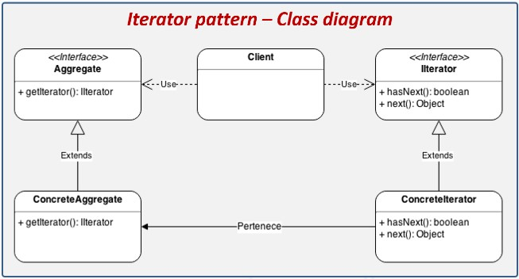

# casoestudio3

					Iterator

Este patrón de diseño permite recorrer una estructura de datos sin que sea necesario
conocer la estructura interna de la misma. Es especialmente útil cuando trabajamos 
con estructuras de datos complejas, ya que nos permite recorrer sus elementos mediante 
un Iterador, el Iterador es una interface que proporciona los métodos necesarios para 
recorrer los elementos de la estructura de datos, los métodos más comunes son:

hasNext: Método que regresa un booleano para indicar si existen más elementos en la 
estructura por recorrer. True si existen más y false si hemos llegado al final y no 
hay más elementos por recorrer.
next: Regresa el siguiente elemento de la estructura de datos.

Referencias Bibliográficas

Blancarte, O. (2016). Introducción a los Patrones de Diseño (1.a ed.). Oscar Javier Blancarte Iturralde.
	https://reactiveprogramming.io/book-demos/Introduccion-a-los-patrones-de-dise%c3%b1o.pdf
	
